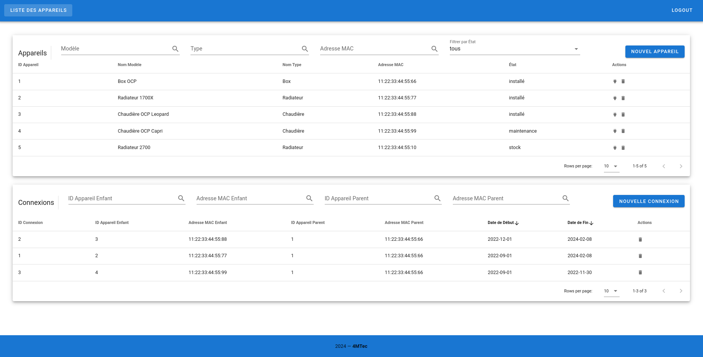

# Projet Full Stack 4MTec - Frontend (Vue.js)



## Introduction

Ce projet contient la partie frontend de notre application (réalisée avec Vue v2). Elle permet de visualiser les données de la base de données et d'interagir avec elles (via l'API).

La plupart des éléments de la page web ont été réalisés avec la librairie Vuetify.

## Structure du projet

Le code source du projet se trouve dans le dossier `src`. Son contenu est le suivant :

- `config.ts` : fichier de configuration contenant l'URL utilisée par l'API pour communiquer
- `main.ts` : fichier principal instanciant l'application Vue
- `routes.ts` : fichier contenant les routes de l'application Vue
- `components`: dossier contenant la liste des différents composants de l'application
  - `FooterComponent.vue` : le footer de l'application
  - `ListeAppareils.vue` : le composant principal de notre application permettant de visualiser les données
  - `NavBar.vue` : le header de notre application
  - `NotFound.vue` : le composant à afficher lorsque la page demandée n'existe pas

## Setup du projet
```
npm install
```

### Lancer le serveur de développement
```
npm run serve
```

### Construire le serveur de production
```
npm run build
```
